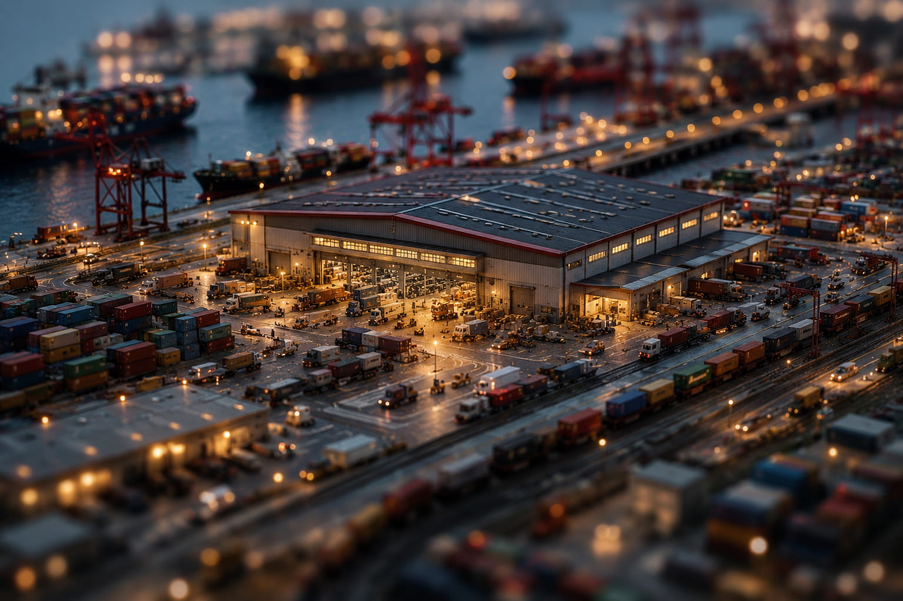

# 世界の問屋——中国とグローバル経済の奇妙な共依存

2026年5月12日

---

Amazonで注文したものが翌日に届く。  
スマートフォンは安く、高性能になり続ける。  
EVも太陽光パネルも、いまや「環境技術」として語られる。

けれど、その裏側にある巨大な物流と製造の重さを、普段意識することは少ない。

---

## 「世界の工場」から「世界の問屋」へ

かつて中国は「世界の工場」と呼ばれた。

安価な労働力を背景に、欧米企業の下請けとして大量生産を担う存在——そんなイメージだった。

しかし2020年代に入る頃には、もう少し違う構図になっている。

単なる工場ではない。  
中国は、素材・加工・組立・物流・輸出までを一体化した、巨大な“流通プラットフォーム”になった。

レアアース。  
電子部品。  
化学素材。  
精密加工。  
バッテリー。  
港湾インフラ。

それぞれ単独ではなく、巨大なサプライチェーンとして接続されている。

つまり中国は、単なる「作る側」ではなく、世界経済そのものの“問屋”になった。

---

## クリーンな国、汚れる国

ここで少し奇妙なことが起きる。

欧米先進国は、環境意識や脱炭素を強く掲げる。  
街は綺麗になり、工場は減り、金融やIT産業が中心になる。

しかし実際には、多くの製造工程は海外へ移された。

鉱山。  
精錬。  
化学処理。  
電子部品製造。

エネルギーも資源も使い、環境負荷の高い工程は、中国をはじめとするアジア圏へ集まっていく。

つまり「汚れる工程」は外へ出し、完成品だけを輸入する構造だ。

もちろん、それは単純な善悪ではない。

中国側も、その役割を引き受けることで莫大な利益を得た。  
外貨を獲得し、産業を育て、技術を蓄積し、国家として強くなった。

だからこれは、「搾取される中国」というだけの話でもない。

むしろ中国は、その構造を極めて現実的に利用したとも言える。

---

## 依存は一方向ではない

興味深いのは、互いに批判しながら、互いに依存していることだ。

欧米は中国依存を減らしたいと言う。  
中国は欧米中心の秩序に反発する。

だが実際には、サプライチェーンは簡単には切れない。

世界経済は、巨大な物流網として一体化しすぎてしまった。

ある国だけで完結する工業製品は、ほとんど存在しない。

資源は別の国。  
設計は別の国。  
製造は別の国。  
消費はまた別の国。

そしてその中心に、中国の巨大な港湾や倉庫群が静かに存在している。

---

## 「問屋」という存在

問屋という言葉は、日本では少し古い響きがある。

しかし実際には、現代の中国を表すには意外と近い。

自ら全部を消費するわけではない。  
全部を発明するわけでもない。  
だが、世界中のモノが一度そこへ集まり、加工され、仕分けされ、再び流れていく。

巨大な港。  
無数のコンテナ。  
24時間動く物流網。

そこにはイデオロギーよりも先に、“流通”そのものの力がある。

世界は対立しているようで、実際には互いの倉庫を共有している。

そして私たちの日常も、その静かな巨大システムの上に成り立っている。

