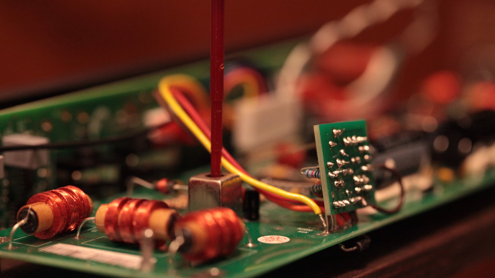

# Coilcraft社製 SLOT TEN-5-10 廃盤

2026年4月7日

---

Moog Etherwaveのキャビネットを開けるのは、いつも少し儀式めいた作業だった。

側面のネジを外し、慎重にふたを持ち上げると、L5、L6、L11——三本の可変インダクタが現れる。専用工具Tritunerを使い、コアをそっと回してゼロビートを探す。ふたの有無で周波数が変わるから、最終調整はふたを閉めた状態でやり直す。この行ったり来たりの面倒な作業。しかしこの手続きそのものが、Etherwaveというものを特徴づけているひとつであることは間違いない。この儀式は面倒くさく、そして愛おしい。このアンビバレンスこそ、Etherwave テルミンの魅力なのだ。

その可変インダクタ、Coilcraft SLOT TEN-5-10が2024年に廃盤になった。

---

## TOKOからCoilcraftへ、そして廃盤へ——二度目の喪失

2000年代初頭、Etherwaveの初期モデルに使われていたTOKO製の可変インダクタが入手困難になった。Moogはやむなく設計を変更し、Coilcraft SLOT TEN-5-10に移行した。その際、単なる差し替えではなくいくつかの部品も変更を余儀なくされた。いくつかの抵抗の値がTOKOを使用した基板とCoilcraftを使用したそれで異なるのはその名残だ（ボードリビジョン:211C以降）。

そのCoilcraftも今度は廃盤になった。私は2016年にCoilcraftからこのインダクタを10個送ってもらっている。2026年になってCoilcraft社に問い合わせたところ、丁寧な回答を得た。内容は以下の通り。

<blockquote style="overflow:hidden;">
  
 
Coilcraft 
  Slot Ten製品ファミリーは、製品ライフサイクル終了（EOL）となります。このシリーズは、後継製品の提供なしに販売終了となります。

  
変更理由： 製品ライフサイクル終了。RoHS指令に準拠していません。

  
変更による影響： 本製品は販売終了となります。

  
実施日： 最終発注は2024年6月30日までに完了する必要があります。すべての注文は2024年9月30日までに出荷する必要があります。これらの期日を過ぎた注文はサポート対象外となります。

</blockquote>

理由のひとつははRoHS——EUの鉛フリー規制だ。SLOT TENシリーズはコアとはんだに鉛を含み、RoHS対応版は作らないとCoilcraftは明言している。加えて、大型のスルーホール可変インダクタそのものの需要が市場から消えつつある。スマートフォンの時代に、こうした部品の居場所はもうない。

---

## 可変インダクタの根本的な問題

その儀式には、少し皮肉な側面もある。キャビネットを開けてコアを調整しなければならない理由の一つは、可変インダクタのフェライトコアが温度によってインダクタンス値を変化させるからだ。つまり、ドリフトするから調整が必要で、調整する対象そのものがドリフトの原因でもある。まるで禅問答のような構造だ。

Etherwave Proが「rock stable」と言われるのは、発振器に固定インダクタと可変コンデンサを組み合わせた設計を採用しているからだ。エアコアの固定インダクタは温度依存性がほぼゼロに近い。

つまりSLOT TEN-5-10の廃盤は、喪失であると同時に、問いかけでもある。

---

## テルミンはつづく

次のビルドでは、固定インダクタ（エアコア）と可変コンデンサの組み合わせを検討したい。

ただしこれは一筋縄ではいかない。Theremin Worldのフォーラムでも「固定インダクタ＋可変コンデンサは理論上は同じチューニング範囲を得られるが、実際には発振器の安定性が保てない」という指摘がある。理論と実践の違い、というわけだ。しかしEtherwave Proはまさにその構成で「rock stable」を実現している。できないのではなく、設計の工夫が必要ということだろう。

L5、L6、L11を調整する手つきは、今となっては身体に染み込んでいる。その感覚ごと設計から消えるとしたら——それはEtherwaveという楽器との別れでもある。

しかしテルミンはそもそも、時代とともに変わり続けてきた楽器だ。真空管からトランジスタへ、TOKOからCoilcraftへ、そして次へ。部品が変わり、設計が変わり、時代が変わっても、どんな逆境にあっても生き残っていくことだろう。テルミン、そしてレオン・テルメンその人がそうであったように。

---

## 参考リンク

- Theremin WORLD — EMテルミンにはTOKO製インダクタが必要です！（2007/10~）  
 <a href="http://www.thereminworld.com/Forums/T/26293/toko-inductors-needed-for-em-theremin" target="_blank">http://www.thereminworld.com/Forums/T/26293/toko-inductors-needed-for-em-theremin</a> 
]
- Theremin WORLD — EM/エーテルウェーブ・テルミンの部品探しを手伝ってください。（2011/8~）  
 <a href="http://www.thereminworld.com/Forums/T/26616/help-finding-parts-for-emetherwave-theremin?Page=0" target="_blank">http://www.thereminworld.com/Forums/T/26616/help-finding-parts-for-emetherwave-theremin?Page=0</a> 

 - Theremin WORLD — DIY Etherwave テルミン用インダクタ交換部品（2024/8~）  
 <a href="http://www.thereminworld.com/Forums/T/33999/diy-etherwave-theremin-inductors-replacement?Page=0" target="_blank">http://www.thereminworld.com/Forums/T/33999/diy-etherwave-theremin-inductors-replacement?Page=0</a> 

 ---